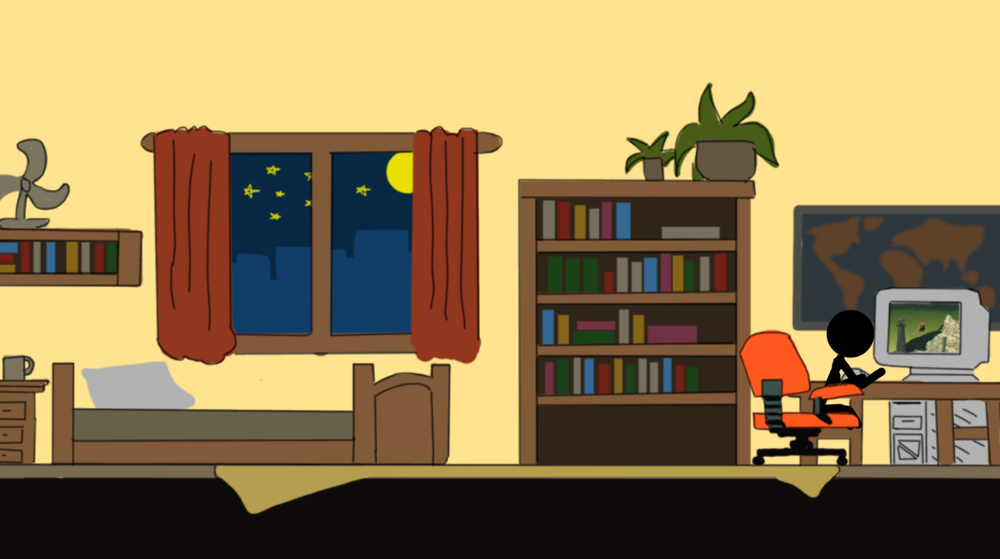
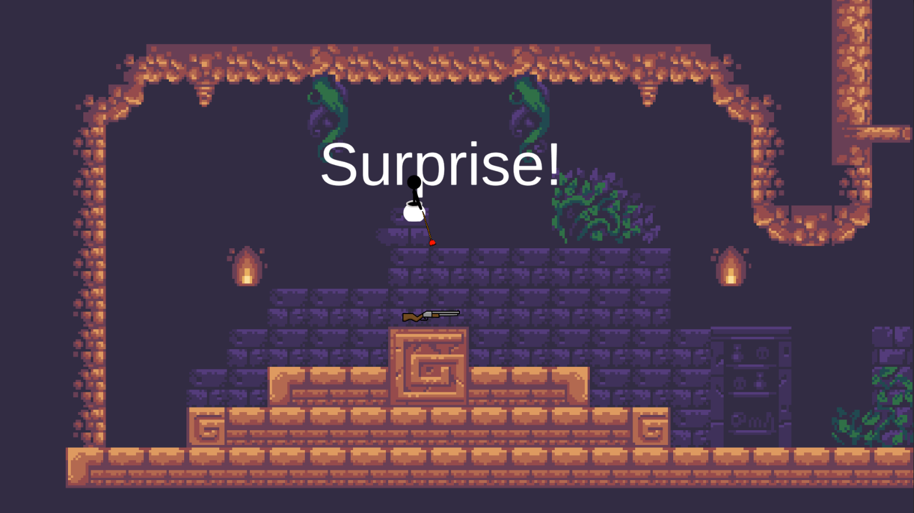
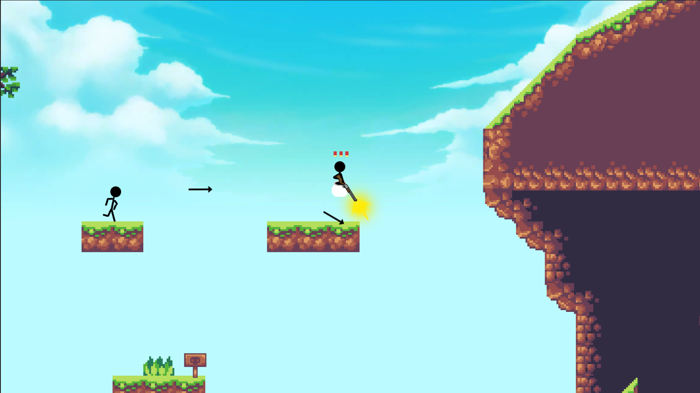

# Getting Over It-But Is it?

A game project i made for the 2021 CGX Grad Jam

## Features
  
* Getting Over It-But Is It?
  - Geting over it mechanic - with the plunger
  - Some adjustment to the movement using different tool - with the gun
  - Using new unity 2D animation, 2D IK
  - Level design and cutscenes
  - sound effect and background music

## ScreenShots
&nbsp;&nbsp;&nbsp;&nbsp;

